# Cas Pràctic 1

## Índex

- Perque és una bona solució
- Presuspost
- GUIA DE CREACIÓ DE L’USUARI ADMINISTRADOR/A I USUARI/A
- GUIA DE CREACIÓ D’UNITATS COMPARTIDES
- GUIA D'INSTAL·LACIÓ D'ADRECES DIRECTES A L'ESCRIPTORI
- EXEMPLE DE FER UN BACKUP
- EXEMPLE D'ÚS DE CONSULTAR UN DOCUMENT PER PART DE L’USUARI
- COMPROVACIÓ DE SI ES POT ELIMINAR UN FITXER PER PART DE L’USUARI

## PERQUÈ ÉS UNA BONA SOLUCIÓ

Almacenar els documents i els arxius a un núvol es una bona idea ja que evitem perdre la
informació en cas de haver-hi algun problema al disc dur.

## PRESUSPOST

El preu serà de 9,99€ al mes o de 99,99€ al any.
Amb la segona opció ens ahorrarìem un 17%.

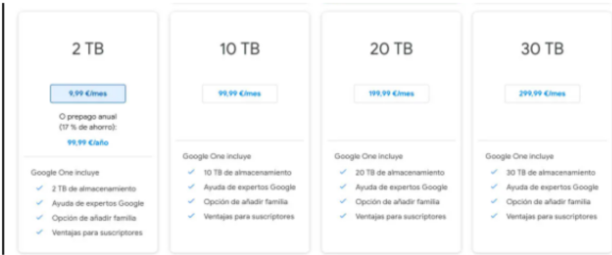

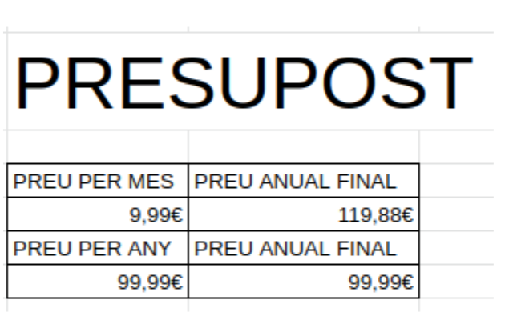

## GUIA DE CREACIÓ DE L’USUARI
## ADMINISTRADOR/A I USUARI/A

Per iniciar sessió al google drive hem de ficar el nostre correu electrònic i la contrasenya.
Aquest serà el usuari administrador:

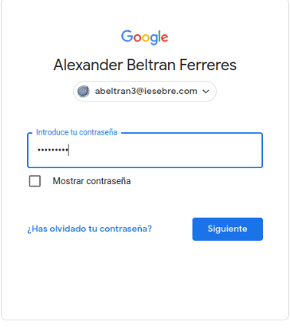

## GUIA DE CREACIÓ D’UNITATS COMPARTIDES

Per crear la unitat compartida “Backup” ho fem desde el compte d'administrador, fem clic
dret sobre la pantalla i premem a crear nova carpeta.

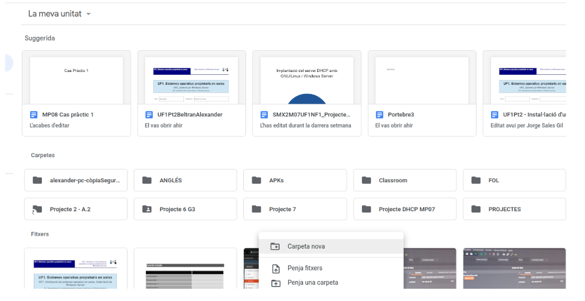

després ens demanarà un nom, en aquest cas ficem Backup.

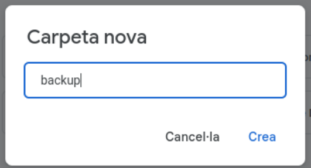

Un cop creada fem clic dret a sobre de la carpeta i fiquem compartir.

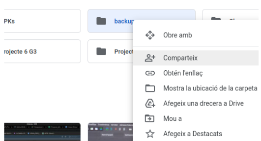

I finalment afegim el correu al qual li volem compartir i a la dreta podem seleccionar els
permisos que volem assignar-li, en aquest cas he ficat sol lectura ja que serà el compte
d'usuari.

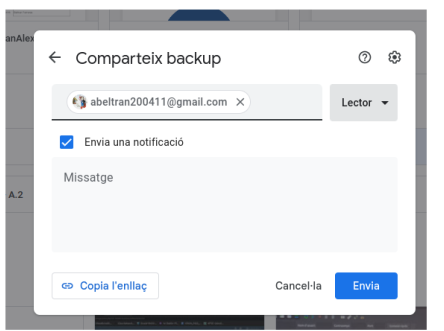

Després fem el mateix amb “Documents”.

## GUIA D'INSTAL·LACIÓ D'ADRECES DIRECTES
##          A L'ESCRIPTORI

Per crear un accés directe del google drive a l'escriptori hem d’anar a la configuració del
nostre equip i entrar a comptes en línea, després fem clic a google i fiquem el nostre
compte, un com fet això ens apareixerà un directori al gestor de fitxers amb el nostre correu,
si entrem dintre podem accedir a tot el que tenim al google drive.

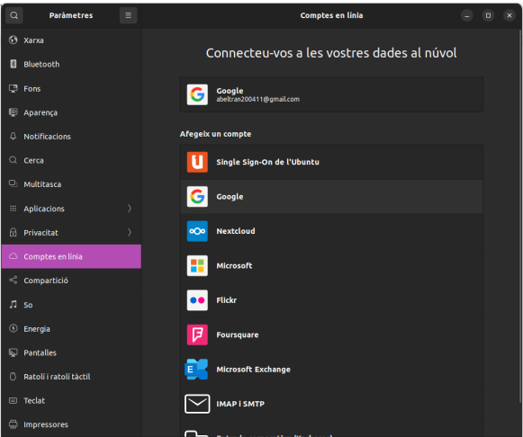

## EXEMPLE DE FER UN BACKUP

Per fer un backup a l'escriptori hem de entrar al google drive desde el gestor de fitxers,
busquem la carpeta que volem i la arrosseguem a la part inferior de la barra esquerra.

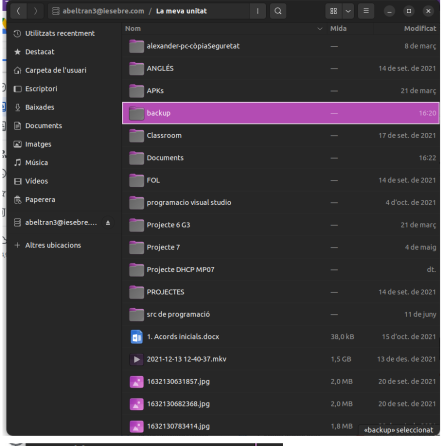

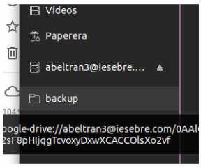

## EXEMPLE D'ÚS DE CONSULTAR UN
## DOCUMENT PER PART DE L’USUARI

Per consultar un document hem d’accedir al google drive desde els fitxers, després hem de
entrar a la carpeta “Documents” i ja podrem consultar el fitxer que vulguem.

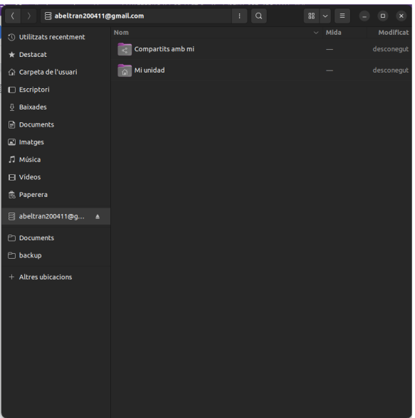

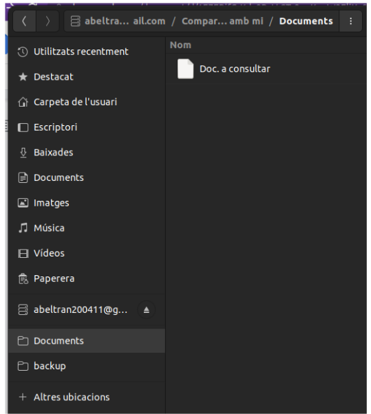

## COMPROVACIÓ DE SI ES POT ELIMINAR UN
##     FITXER PER PART DE L’USUARI

L’usuari no pot eliminar cap fitxer ja que domes té permís de lectura, si intenta eliminar-lo li
saltara un avís de que se li ha denegat el permís.

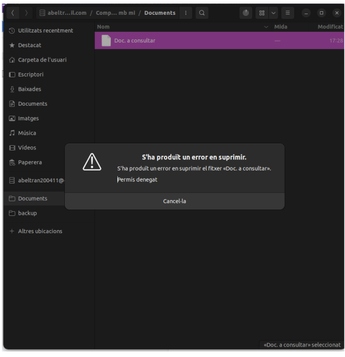
