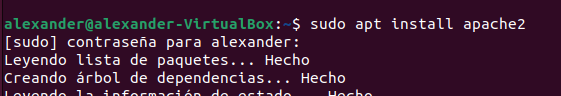
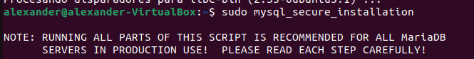
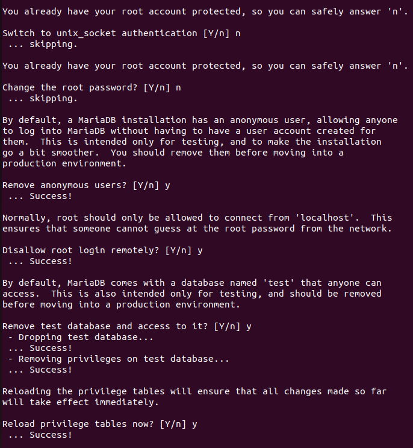
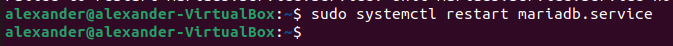
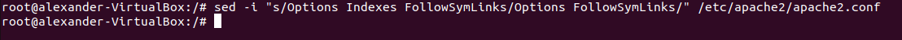

# INTAL·LACIÓ OWNCLOUD

## REQUISITS S'INSTAL·LACIÓ

- Sistema operatiu Ubuntu 20.04 LTS o superior.
- 512 MB de RAM.

## GUIA D'INTAL·LACIÓ


### INSTAL·LAR APACHE

Primer hem d'instal·lar el servidor apache2 amb la comanda 
```sh

sudo apt install apache2

```



### INSTAL·LAR MARIA DB

Despres instal·lem MariaDB amb la comanda 
```sh

sudo apt-get install mariadb-server mariadb-client -y

```


Ara configurem la instal·lació amb 

```sh

sudo mysql_secure_installation

```



Un cop executada ens demanará configurar.
Aquí està la meva configuració:



Finalment reiniciem el servidor MariaDB amb la comanda 
```sh

sudo systemctl restart mariadb.service 

```
o amb 

```sh

sudo service mariadb.service restart

```




### CREAR BASE DE DADES OWNCLOUD

Entrem a Maria DB amb la comanda 
```sh

sudo mysql -u root -p

```

i creem la base de dades escribint 

```sh

CREATE DATABASE owncloud;

```


Ara hem de crear un usuari i una cotrasenya ficant 

```sh

CREATE USER 'nomusuari'@'localhost' IDENTIFIED BY 'contrasenya';

```
Finalment li donem accés al usuari que acabem de crear.

```sh

GRANT ALL ON owncloud.* TO 'ownclouduser'@'localhost' IDENTIFIED BY 'Admin1234' WITH GRANT OPTION;


```
! [](DonarAcces.png)


### INSTAL·LACIÓ OWNCLOUD

Primer hem de desactivar el llistat de directoris del servidor

```sh

sudo sed -i "s/Options Indexes FollowSymLinks/Options FollowSymLinks/" /etc/apache2/apache2.conf

```



