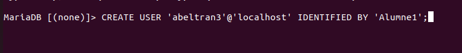
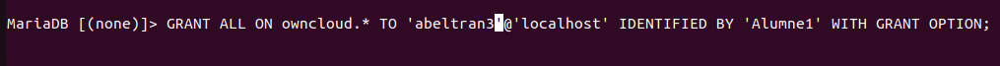
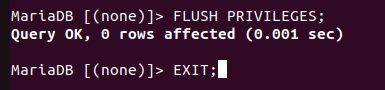
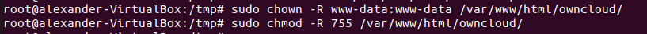
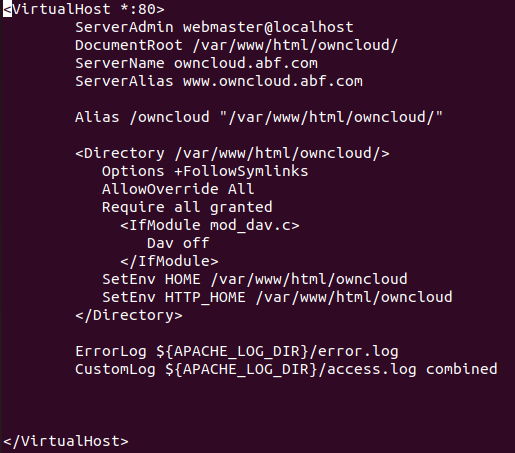

# INTAL·LACIÓ OWNCLOUD

## REQUISITS S'INSTAL·LACIÓ

- Sistema operatiu Ubuntu 20.04 LTS o superior.
- 512 MB de RAM.

## GUIA D'INTAL·LACIÓ


### INSTAL·LAR APACHE

Primer hem d'instal·lar el servidor apache2 amb la comanda 
```sh

sudo apt install apache2

```


Ara hem de desactivar el llistat de directoris del servidor

```sh

sudo sed -i "s/Options Indexes FollowSymLinks/Options FollowSymLinks/" /etc/apache2/apache2.conf

```


### INSTAL·LAR MARIA DB

Despres instal·lem MariaDB amb la comanda 
```sh

sudo apt-get install mariadb-server mariadb-client -y

```


Ara configurem la instal·lació amb 

```sh

sudo mysql_secure_installation

```


Un cop executada ens demanará configurar.
Aquí està la meva configuració:


Finalment reiniciem el servidor MariaDB amb la comanda 
```sh

sudo systemctl restart mariadb.service 

```
o amb 

```sh

sudo service mariadb.service restart

```


### CREAR BASE DE DADES OWNCLOUD

Entrem a Maria DB amb la comanda 
```sh

sudo mysql -u root -p

```

i creem la base de dades escribint 

```sh

CREATE DATABASE owncloud;

```


Ara hem de crear un usuari i una cotrasenya ficant 

```sh

CREATE USER 'nomusuari'@'localhost' IDENTIFIED BY 'contrasenya';

```


Finalment li donem accés al usuari que acabem de crear.

```sh

GRANT ALL ON owncloud.* TO 'ownclouduser'@'localhost' IDENTIFIED BY 'Admin1234' WITH GRANT OPTION;


```


Guardem els canvis i surtim 




### INSTAL·LACIÓ PHP

Fem les següents comandes per preparar la instal·lació

```sh


sudo apt-get install software-properties-common -y
sudo add-apt-repository ppa:ondrej/php****

```
i actualitzem els paquets 

```sh

apt update

```

Ara ja podem intal·lar PHP

```sh

sudo apt install php7.4 libapache2-mod-php7.4 php7.4-common php7.4-mbstring php7.4-xmlrpc php7.4-soap php7.4-apcu php7.4-smbclient php7.4-ldap php7.4-redis php7.4-gd php7.4-xml php7.4-intl php7.4-json php7.4-imagick php7.4-mysql php7.4-cli php7.4-mcrypt php7.4-ldap php7.4-zip php7.4-curl -y

```

Ara hem d'etitar un fitxer per canviar algunes coses, per fer això hem de entrar a:

```sh

sudo nano /etc/php/7.4/apache2/php.ini


```
Hem de canviar els seguents valors 

- file_uploads = On
- allow_url_fopen = On
- memory_limit = 256M
- upload_max_filesize = 100M
- display_errors = Off
- date.timezone = Europe/Madrid


Ara descarregem i descomprimim el programa

```sh

cd /tmp && wget https://download.owncloud.com/server/stable/owncloud-complete-latest.zip
unzip owncloud-complete-latest.zip

```

ara el movem a un altre directori

```sh

sudo mv owncloud /var/www/html/owncloud/

```

També anem a canviar el propietari i els permisos

```sh

sudo chown -R www-data:www-data /var/www/html/owncloud/
sudo chmod -R 755 /var/www/html/owncloud/

```



### CONFIGURACIÓ APACHE2

Per configurar apache2 hem de entrar a owncloud.conf

```sh
sudo nano /etc/apache2/sites-available/owncloud.conf
```


- VirtualHost *80: El servidor contestará a qualsevol IP, ho fa pel port 80.

- ServerAdmin: És l'admisistrador del servidor.

- DocumentRoot: És la ruta per defecte.

- ServerName: És el nom del servidor.

- ServerAlias: És el segon nom del servidor.

- Directory: Tot el que hi ha dintre (baix) s'aplica al diretori indicat.


