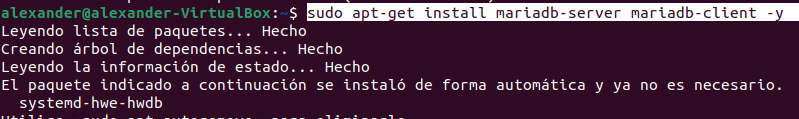

# INTAL·LACIÓ OWNCLOUD

## REQUISITS S'INSTAL·LACIÓ

- Sistema operatiu Ubuntu 20.04 LTS o superior.
- 512 MB de RAM.

## GUIA D'INTAL·LACIÓ


### INSTAL·LAR APACHE

Primer hem d'instal·lar el servidor apache2 amb la comanda 
```sh

sudo apt install apache2

```


### INSTAL·LAR MARIA DB

Despres instal·lem MariaDB amb la comanda 
```sh

sudo apt-get install mariadb-server mariadb-client -y

```



Ara configurem la instal·lació amb 

```sh

sudo mysql_secure_installation

```


Un cop executada ens demanará configurar.
Aquí està la meva configuració:


Finalment reiniciem el servidor MariaDB amb la comanda 
```sh

sudo systemctl restart mariadb.service 

```
o amb 

```sh

sudo service mariadb.service restart

```


### CREAR BASE DE DADES OWNCLOUD

Entrem a Maria DB amb la comanda 
```sh

sudo mysql -u root -p

```

i creem la base de dades escribint 

```sh

CREATE DATABASE owncloud;

```


