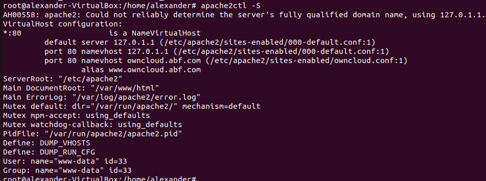

# Configuració Owncloud

Primer hem de fer la següent comanda per veure si Owncloud està habilitat.

```sh
apache2ctl -S
```



La ruta real dels arxius de ownclows és la seguent:


3.3.- Al directori Learn more about owncloud hi ha informació en forma de fitxers pdf. Consulta'ls i respon aquestes preguntes:

· Quin són els tres tipus de protecció de dades que ofereix Owncloud?

  Encryption in Transit, Encryption at Rest i End-to-End Encryption.
 
· Fes una petita descripció de cada un d'ells.

  El xifratge en trànsit garanteix mitjançant l'ús d'HTTPS aprofitant el TLS més recent
  protocols en tots els navegadors i clients compatibles. El xifratge en trànsit és obligatori segons el GDPR
  
  El xifratge en repòs significa xifrar tots els fitxers
  desats del servidor d'aplicacions ownCloud abans de desar-los a l'emmagatzematge real.
  ownCloud utilitza un mètode de xifratge de clau mestra per a això que és compatible amb tots els sistemes de fitxers.
  
  El xifratge de punt a punt és el nivell més alt de dades
  secret combinat amb el més alt nivell de
  protecció de dades. Els desavantatges són que el
  l'usuari ha de pensar en els requisits de secret o de protecció de dades dels fitxers de cadascun
  carpeta, la sobrecàrrega de rendiment a la carpeta
  costat del client i l'administrador del sistema no poden recuperar cap dada per a l'usuari.

· Per quina raó ens recomana utilitzar Owncloud per als documents de Microsoft Office de la nostra empresa?

  Ja que la llei nord-americana obliga a l'empresa a donar accés a les agències governamentals a les dades dels usuaris de Microsoft a petició. Tot i que   això és dolent per a la privadesa de les dades, ara també és un problema de responsabilitat tangible per a les empreses europees: el Tribunal de         Justícia Europeu ha anul·lat l'anomenat "escut de privadesa" el 2020, el que significa que ja no és cap base legal per transferir dades. als Estats       Units. En ajustar de manera intel·ligent, l'ecosistema d'Office, es pot evitar que els documents es transfereixin al núvol de Microsoft.
 
· Això passa a tots els països?

  No, domés als països europeus

· Quina és la llicència d'OWncloud Enterprise?

  Owncloud Comercial License

· I la d'Owncloud Standard?

  AGPLv3

· Es poden veure videos en Streaming directament des de Owncloud?

  Si

· Es poden connectar directoris de Google Drive a Owncloud?
  I Dropbox?
  
  Si, ambdós.

· Compta Owncloud amb antivirus? En cas afirmatiu com es diu?

  si, es diu ClamAV


3.4.- Mostra els següents canvis de paràmetres d'usuari:

Posa't una imatge d'usuari.

  

Afegeix el teu mail de l'Institut.

  

Canvia l'idioma a català.

Mostra la versió d'Owncloud instal·lada.
